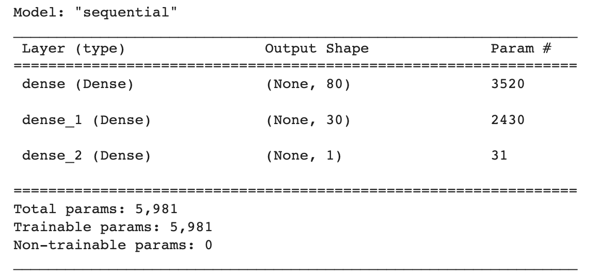
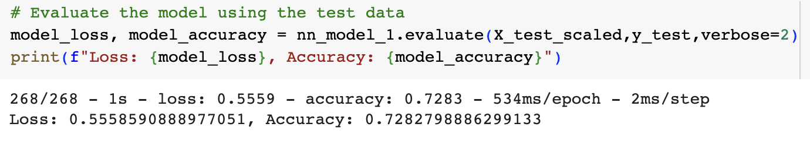
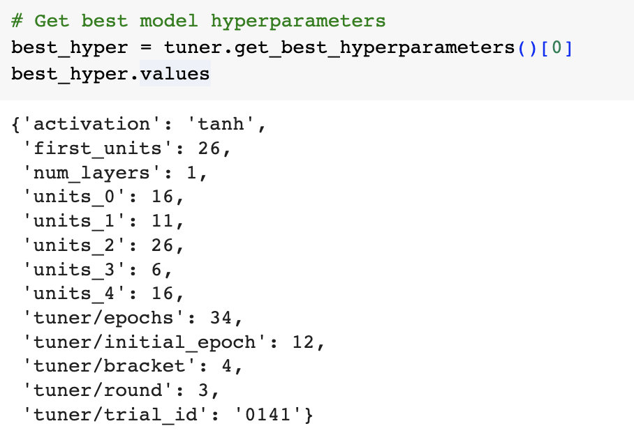
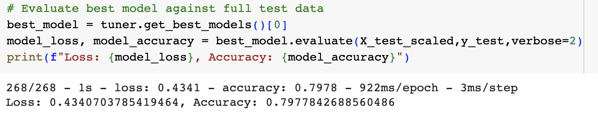

# Deep_Learning_Challenge

Table of Contents
=================

  * [Background](#background)
  * [Objective](#objective)
  * [Neural Network Model Report](#neural-network-model-report)
  * [Method](#method)
  * [References](#references)
  
  
  
## Background
The non-profit foundation ‘Alphabet Soup’ wanted a tool to help it select the applicants for funding with the best chance of success in their ventures. With use of machine learning and neural network, the features provided in the dataset were used to create a binary classifier that can predict whether applicants will be successful if funded by Alphabet Soup. 

## Objective
  
  
From the Alphabet Soup’s business team, the CSV contained more than 34,000 organizations that received funding from Alphabet Soup over the years. Within the dataset are columns that captures the metadata about each organization, which are encompassed in the target and features variables, outlined below:

* `EIN` and `NAME` — Identification columns
* `APPLICATION_TYPE` — Alphabet Soup application type
* `AFFILIATION` — Affiliated sector of industry
* `CLASSIFICATION` — Government organization classification
* `USE_CASE` — Use case for funding
* `ORGANIZATION` — Organization type
* `STATUS` — Active status
* `INCOME_AMT` — Income classification
* `SPECIAL_CONSIDERATIONS` — Special consideration for application
* `ASK_AMT` — Funding amount requested
* `IS_SUCCESSFUL` — Was the money used effectively

## Neural Network Model Report

Please see the file `neural_network_model_report.md` for full details regarding the performance of the deep learning models created for Alphabet Soup. 

## Method

### Data Preprocessing:

* Removed data: `EIN`, `NAME` 
    * Both data were removed in the First Model as they are neither targets nor features; however, `NAME` was added back into the Optimization Models for binning purposes.
* Created cut-off points to bin ‘rare’ categorical variables together in a new value, `Other` for both `CLASSIFICATION` and `APPLICATION_TYPE`
* Converted categorical data to numeric using `pd.get_dummies`
    * The target variable for the model: `IS_SUCCESSFUL`
    * The feature variables for the model: `APPLICATION_TYPE`, `AFFILIATION`, `CLASSIFICATION`, `USE_CASE`, `ORGANIZATION`, `STATUS`, `INCOME_AMT`, `SPECIAL_CONSIDERATIONS`, `ASK_AMT`
* Split the preprocessed data into features and target arrays, followed by splitting in to training and testing datasets 

### Compiling, Training and Evaluating the Model

**First Model:**

* There were two hidden layers with 80 and 30 neurons. The hidden layer activation functions of ‘ReLU’ was used as this is the first go-to for a model. ReLU is faster to compute and does not activate all the neurons at the same time. 
* The output node was 1 as this is a binary classifier model with only one output; was the funding application successful, yes or no. The activation function that was used was ‘Sigmoid’ as this model output is a binary classification between 0 and 1. 

  

* The model prediction accuracy was below the threshold of 75%. Therefore, further optimization is required. 

  

**Optimization Models**
* As noted above, in the preprocessing stage, `NAME` was added back for binning purposes.
* An automated model optimizer was used to obtain the most accurate model possible via a Keras Sequential Model. 
* Hyperparameter options were provided and a search for the best hyperparameters was performed.

  

* Ultimately, the best optimized model was Optimization 3, which achieved a model accuracy of 79.78%, exceeding the 75% goal. 
    * Of note, all Optimization Models exceeded the goal of 75%. 

  

## References 

* Dataset provided by edX UofT Data Analytics, which had been generated by Trilogy Education Services, LLC. This is intended for educational purposes only.

- - -

